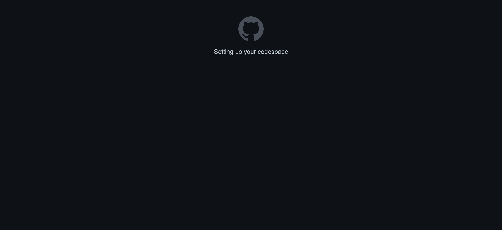

# Uvod

Dobrodošli u _Primijenjenu informatiku_, udžbenik za bilokoga tko želi naučiti detaljnije o programiranju i izradi aplikacija.
Ovdje ćete naučiti kako napraviti aplikacije za web i mobitele s web programiranjem.
Jedna od čari web programiranje je to što omogućava da s istim programskim jezicima i tehnologijama, s vrlo malo promjena, napravite aplikaciju za sve tri glavne platforme: web, mobiteli i desktop računala.
Usto je najpopularnije područje programiranja (2024. JavaScript, glavni jezik za web programiranje, je najpopularniji programski jezik) što donosi veliki broj materijala za učenje i raznovrsne mogućnosti zapošljavanja.

## Za koga je ova knjiga?

Ovaj udžbenik je napravljen kao glavni materijal za učenje za pohađatelje istoimene fakultativne nastave u srednjim školama.
Gradivo je stoga prilagođeno za srednjoškolce.
Udžbenik je detaljniji nego što je zamišljeno da će biti pokriveno tijekom nastave _Primijenjene informatike_.
Određene teme i detalji su izostavljeni iz kurikuluma zbog nedostatka vremena.

Udžbenik predpostavlja vrlo malo što se tiče znanja programiranja.
Svakako, ako ste već prije imali iskustva s programiranje, to vam samo može pomoći.
Očekuje se osnovno znanje programiranja; nema veze koji ste programski jezik koristili, ali bitno da je razumijete što su varijable, petlje, kako napraviti jednostavni program, itd.
Ako nikad prije niste taknuli niti jedan programski jezik, preproučujem vam da prvo naučite osnove programiranja pa onda pređete na ovu knjigu.

Uz učenike srednjih i osnovnih škola, ovaj udžbenik je dovoljno detaljan da ga bilo koja osoba koju zanima (web) programiranje može koristiti i (nadam se) naučiti podosta iz njega.
Znanje predstavljeno dovoljno je detaljno da vas stavi na put do zapošljavanja kao (junior) web programer.

## Zašto _Primijenjena_?

Odlučio sam se za naziv _Primijenjena informatika_ jer mi je cilj s ovim kurikulumom i udžbenikom učenicima pobližje prikazati što i kako profesijonalni programeri rade.
Fokus tijekom cijelog udžbenika i kurikuluma biti će na praktičnu primjenu znanja.
Učiti će te kroz projektno učenje, raditi ćete vlastite aplikacije. U početku će one biti jednostavne, ali će postajati sve složenije.
Naravno, teorije će uvijek biti, ona je neophodna, ali u određene teme neću ulaziti toliko duboko.

U osnovnoškolskom i srednjoškolskom informatičkom kurikulumu (barem izvan strukovnih škola), nema fokusa na izradu softvera kakav se u suvremenom dobu u praksi proizvodi i koristi.
I naravno, veći je fokus na teoriji, koja kad-tad postane nužna.
Ideja _Primijenjene informatike_ je da potkrijepi standardni informatički kurikulum i omogući učenicima da iskoriste to znanje da naprave svoje aplikacije koje bi zapravo imale šansu uspjeha.

## Kako koristiti ovu knjigu?

### Projektno učenje

Programiranje, kao i većina vještina, se ne može naučiti kroz pasivno čitanje.
Kao i matematika, vježba čini stručnjaka: matematika se ne može naučiti samo čitanjem udžbenika, zahtjeva vježbanje zadataka.
Isto vrijedi i za programiranje, samo što u slučaju programiranja cilj će biti da ti zadaci budu uglavnom projekti, odnosno cjelovite web stranice/aplikacije.

Ovaj udžbenik koristi projektno učenje: tijekom udžbenika ćemo zajedno (ali i vi samostalno!) napraviti nekoliko aplikacija.
Stoga se poglavlja u ovom udžbeniku dijele u dvije kategorije: konceptualna i projektna poglavlja. U konceptualnim poglavljima ćete naučiti nešto novo, a u projektnim poglavljima ćete primjeniti novonaučeno znanje tako što ćemo zajedno napraviti nekoliko manjih web stranica i aplikacija. 

Svakih nekoliko poglavlja bit će naputak da bi sada bilo dobro vrijeme da samostalno isprogramirate neku web stranicu odnosno aplikaciju te prijedlozi tema i upute kako najbolje izvršiti projekt.
**Ne preskačite** niti projektna poglavlja, a pogotovo ne samostalno programiranje. Bez samostalnog rada nećete naučiti programirati i znanje koje ste naučili u konceptualnim poglavljima brzo će ispariti.
Cilj ove knjige i kurikuluma je da naučite to raditi, da naučite raditi projekte i sofisticirane aplikacije, da bi to mogli ostvariti na visokoj razini, morate se aktivno poboljšavati.

### Kvizovi

Uz projektna poglavlja i samostalne radove, na kraju svakog poglavlja nalazi se kviz čiji je cilj utvrditi novo znanje.
Postoji nekoliko vrsta pitanja u kvizovima, najjednostavniji su oni s pitanjima višestrukog izbora i kratkog odgovora (najviše nekoliko riječi).
Još postoje i pitanje u kojima će se od vas tražiti da odredite hoće li se prikazani kod pokrenuti bez greške i, ako hoće, što će ispisati.

Rezultati kvizova se spremaju isključivo lokalno i ne vidi ih nitko osim vas. Ni kvizove nemojte preskakati jer vam pomažu odmah primjeniti to što ste upravo naučili.

{{#quiz ../../quizzes/choice.toml}}

### Interaktivni primjeri koda

Neki primjeri koda, kao ovaj ovdje, su statični: ne možete ga pokrenuti ili raditi išta s njim.
U ovakvom obliku će se nalaziti komadi koda koji se ne mogu sami po sebi izvršiti ili su manji dijelovi većeg programa.

```javascript,filepath=script.js
{{#include primjeri/let_deklaracija.js}}
```



Ovaj komad koda je napisan u programskom jeziku JavaScript, kojeg ćete ubrzo upoznati, i jednostavno postavlja novu varijablu `poruka`.
Kod svakog takvog primjera, možete vidjeti naziv datoteke u kojem se (može) nalazit i programski jezik u kojem je napisan.

S druge strane, uz takve statične primjere koda, u ovoj knjizi postoje i tri vrste interaktivnih primjera koda. Drugim riječima, taj kod možete odmah izmjeniti i izvršiti unutar udžbenika.

Prva vrsta su gotovo ista kao i statični primjeri, ali ove možete izmjeniti i izvršiti unutar udžbenika. Njih ćete vidjeti za JavaScript i, u kasnijim poglavljima, SQL (nema veze ako ne znate što je išta od toga!).

```javascript,filepath=script.js
{{#include primjeri/console_log.js}}
```


Primjetite da u gornjem desnom kutu primjera piše naziv datoteke: `script.js`.
Taj naziv će se nalaziti na gotovo svakom primjeru da bi rješili dobro poznato pitanje u programiranju: gdje da stavim taj kod?
Uz to, svaki naredni primjer koda u istoj datoteci (s istim nazivom), ima pristup kodu iz prijašnjih primjera u toj datoteci (u istom poglavlju).
Zbog toga se kada izvršite zadnji primjer ispiše poruka s predzadnjeg primjera: u istoj su datoteci!

Pokušajte promjeniti poruku i pokrenuti kod!

Iako je jedna mala kutija s kodom dovoljna za primjere samo s JavaScriptom, web stranice se sastoje od nekoliko programskih jezika.
Također bi bilo lijepo da zapravo vidimo što se događa na toj stranici!
Zbog toga su primjeri s HTML-om, CSS-om, i/ili JavaScriptom prikazani u sljedećem obliku pomoću platforme Codepen.
Njih isto možete izmjenjivati i vidjeti što su vaše promjene napravile.



Primjetite `HTML` tipku u gornjem lijevom kutu Codepena, ako ju pritisnete otvoriti će se prozor za uređivanje HTML-a te web stranice.
Promjenite naslov ispisan na stranici i pogledajte što će se dogoditi!

Konačno, za najkompliciranije tehnologije i primjere koda do kojih ćemo doć tek za nekoliko mjeseci,  u knjizi ćemo koristiti potpuni Visual Studio Code uređivač koda (nastavite čitati da saznate što je to!) preko StackBlitza.
I to sve u knjizi!
A to je program koji profesijonalni programeri koriste kada pišu kod i on podržava sve značajke koje programeri trebaju, i to je uređivač koda koji će te vi koristiti tijekom ove knjige.
Bez brige, nećete ništa morati instalirati na vašem računalu; ako čitate ovu knjigu, već imate na računalu sve što vam je potrebno!

Bitno je napomenuti da, za razliku od rezultata kvizova koji se spremaju unutar vašeg preglednika, promjene koje napravite na svim primjerima koda se ne spremaju i resetirati će se kada osvježite knjigu te da StackBlitz primjeri ne rade u Firefoxu.

{% embed stackblitz id="vitejs-vite-7qf2rh" width="150%" height="72rem;" file="src/App.svelte" view="both" hideExplorer="0" %}

Uskoro ćete se upoznati s gotovo istom verziju Visual Studio Codea kakvog vidite ovjde i nju će te koristiti za programiranje, vježbanje, i izradu projekata tijekom ove knjige.
Naravno, možete i toplo vam preporučam, da ga nastavite koristiti nakon što završite s ovom knjigom.
Međutim, ako želite izabrati neki drugi uređivač koda, to je sasvim u redu.

Poigrajte se s kodom i tekstom koji vidite u primjeru da vidite kakav će utjecaj imati na stranicu. 
Slobodno istražite koje sve trikove Visual Studio Code ima u rukavu!
Upoznati ćete u ovoj knjizi neke od njih.

## Vaše programsko okruženje

### Visual Studio Code

Već sam spomenuo da će te koristiti Visual Studio Code kao uređivač koda za programiranje, kojeg ću nadalje zvati VSCode.
Možda ste već prije, ako ste programirali u Pythonu, koristili IDLE ili nešto slično tome.
VSCode je _integrirano razvojno okruženje_ (IDE), sadržava sve potrebne alate za programiranje.

To svakako uključuje i sam uređivač teksta kao i kod IDLE-a, ali on u VSCode-u on je i inteligentan.
VSCode ima IntelliSense, tehnologiju koja daje sugestije koda dok programirate.
Primjerice, ako ste negdje prije u kodu deklarirali varijablu `let brzina = 170` i kasnije u kodu krenete pisati `brzina`, VSCode će vam predložiti dovršetak toga što ste napisali s njezinim imenom.
Naravno, ovo je najosnovniji primjer, VSCode ima puno drugih značajki za koje ćete saznati, jedna od najjednostavnijih je to što oboja ključne dijelove koda, kao što ste vidjeli u primjeru gore.

Uz IntelliSense, VSCode ima ugrađeni terminal, eksplorer datoteka unutar projekta, podršku za gotovo sve jezike koji postoje pomoću ekstenzija te razno-razne teme i izglede.
VSCode je također IDE koji koristi većina web programera u profesijonalnom okruženju i, po mojem mišljenju, izgleda dosta lijepše od IDLE-a.

### Računalo u oblacima

VSCode nećete instalirati na vaše računalo (iako možete, upute se nalaze na kraju knjige) nego ćete koristiti računalo u cloudu preko platforme GitHub Codespaces.
GitHub je platforma za programere na kojem mi pohranjujemo i djelimo kod, međusobno komuniciramo i reklamiramo naš softver.
Praktički društvena mreža za programere koju ćete i vi korisiti.

GitHub Codespaces je GitHubova platforma koja omogućuje bilo kome tko ima GitHub račun (besplatan je!) da dobije virtualno računalo koje se nalazi na GitHubovim serverima i njemu pristupi preko VSCode-a u pregledniku.
Tako je, sve što vam je potrebno da bi u potpunosti iskoristili ovu knjigu je web preglednik, najbolje Chrome, i to je sve, specifikacije vašeg računala nisu važne.
To virtualno računalo (_Codespace_) ima 2 procesorske jezgre, 8 GB RAM-a te ~60 GB diska odnosno stane memorije.
Te specifikacije su više nego dovoljno za ono što ćemo mi raditi tijekom ove knjige.
Promjene koje napravite u tom Codespaceu su trajno spremljene u cloudu i možete se bilo gdje prijaviti i nastaviti s programiranjem.

Korištenje Codespacea je poželjno jer nama omogućava da standardiziramo razvojno okruženje svih učenika i na taj način osiguramo da svi mogu isprobati i pokrenuti sve što smo zamisili neovisno o specifikacijama računala u školi ili kod kuće.
Zajamčeno je da svaka škola i učenik ima računalo dovoljno snažno da pokrene Chrome, ostalo nije važno.
Drugi razlog je što ne zahtjeva nikakvu lokalnu instalaciju programa ili postavljanja radnog okruženja, a to otklanja cijeli spektar problema koji dolaze s instalacijom softvera (nažalost, taj problem ne nestaje nikada).

#### OK, kako da ja dobijem Codespace?

Prvi korak je da registrirate GitHub račun, za to vam je potrebna email adresa i neka lozinka (izaberite snažnu lozinku!) i to je sve.
GitHub ćete koristiti često tijekom učenja tako da će se ovo vrijeme isplatiti!

Otvorite GitHubovu <a target="_blank" href="https://github.com/signup">stranicu za registraciju</a> i unesite vašu email adresu, lozinku i korisničko ime.
Preporučam vam da ne upalite slanje promotivnih emailova od GitHuba.
Zatim, GitHub će od vas tražiti da rješite nekakav jednostavan zadatak da bi potvrdio da niste robot.
Ako želite, možete odabrati i glasovni, umjesto vizualnog, zadatka.
Slijedite upute i kada ste gotovi, nastavite dalje.
GitHub će vam poslati kod na unesenu email adresu za verifikaciju računa: otvorite vaš email račun i unesite taj kod.

Sada kada ste to učinili, registracija je dovršena i GitHub će vas odvesti na vaš profil.
Drugi korak je da otvorite <a href="https://informatika.petagimnazija.hr" target="_blank">našu stranicu za izradu Codespacea</a> i prijavite se s vašim GitHub računom te odobrite pristup našem serveru.
Nakon toga ćemo mi za vas napraviti Codespace i odvesti vas na njega.
To je to! Sljedeći put kada ćete htjeti otvoriti vaš Codespace, otvorite tu stranicu i opet se prijavite s GitHubom i dočekati će vas tamo gdje ste stali.

Za nekoliko sekudni bi vas trebao dočekati ovakav ekran:



Postavljanje Codespacea prvi put može potrajati nekoliko minuta tako da budite strpljivi, isplatit će se.
Kada se završi, dočekat će vas potpuni VSCode u pregledniku u kojem odmah sada možete krenuti programirati.
Podržava automatski puno jezika (uključujući Python, JavaScript, HTML, CSS, C/C++, SQL, itd.), a vi možete instalirati ekstenzije da dodate podrške za još njih. 

Popis svega što dolazi predinstalirano nalazi se na gore navedenoj stranici.
Korištenje vašeg Codespacea je za sada neograničeno i naravno smijete ga koristiti za bilo što vezano uz informatiku, ne nužno samo za ovaj predmet i knjigu.

## Zaključak

Sada ste spremni u potpunosti iskoristiti sve što ova knjiga i kurikulum nude.
Tijekom sljedećih nekoliko poglavlja naučiti ćete kako raditi sofisticirane web aplikacije, to znanje ćete moći iskoristiti za izradu mobilnih i desktop aplikacija!
U narednom poglavlju (prvo projektno poglavlje!) ćemo početi tako što ćemo prvo zajedno napraviti jednostavnu web stranicu da vidite praktičnu primjenu tog znanja!
Nemojte preskakati ovo poglavlje, čak i ako preferirate učiti korak po korak, jer ćete u njemu naučiti kako koristit Visual Studio Code!

Nadam se da ćete uživati u ovom procesu učenja, ako imate prijedloge za poboljšanje knjige ili kurikuluma, neovisno koliko veliko ili malo (čak i ako je samo tipfeler!), slobodno nam javite!
Sretno programiranje!
