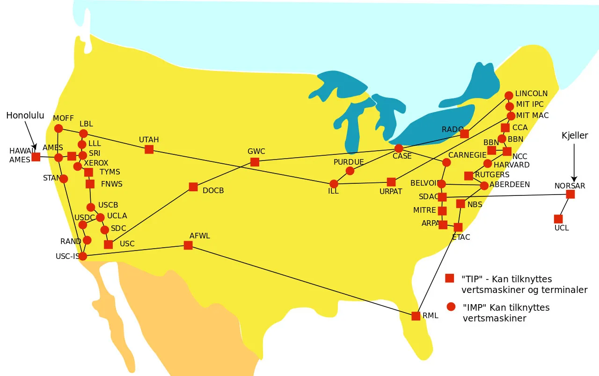

## Internet

Predače Interneta kao što su ARPANET bile su u početku eksluzivne.
Broj korisnika bio je malen, ograničen na profesijonalne korisnike, uglavnom sveučilišta i vladine organizacije.
Stoga je i broj **čvorova** bio relativno mali.

Za razliku od ARPANET-a, na Internet su povezane milijarde uređaja, od osobnih računala, servera do pametnih automobila.
Očekuje da će broj ne-IoT uređaja povezanih na Internet (računala, serveri, itd.) u 2025. dostići 10 milijardi.
Sam broj uređaja je ogroman, veći je od populacije Zemlje, a svakom godinom se drastično povećava.

> [!DEFINICIJA]
> **Čvor** je fizičko računalo koje je član računalne mreže.

*Dijagram ARPANET mreže u rujnu 1974. Izvor: Britannica.*

Dakle, zbog tolikog broja korisnika koje mora služiti, Internet mora biti dizajniran da podrži toliki broj korisnika.
Kao što smo prije spomenuli, Internet je masovni, distribuiran sustav.
Najlakše ga je zamisliti kao *mrežu mreža*: ogromna mreža stvorena od velikog broja manjih mreža, npr. WAN, koje su same stvorene od još manjih mreža, npr. LAN.
Prostire se cijelom Zemljom, prolazi kroz stotine države i svih sedam kontinenata.

Internet načelno nema središnju organizaciju koja njime upravlja.
Malo je čudo što je moguće (na relativno lagan način) napraviti web stranicu kojoj netko može pristupiti putem Interneta iz (više-manje) bilo koje zemlje svijeta na gotovo bilo kojem uređaju s pristupom Internetu.
To je moguće zbog standardizacije koju provede međunarodne organizacije.

Jezgra Interneta sastoji se od nekoliko ogromnih, medunarodnih korporacija (ISP-ova) koji se vlasnici nekoliko skupina međusobno povezanih  mreža s velikim protokom.
Glavni dio tih mreža je skupina podvodnih komunikacijskih kablova koji povezuju Internet izmedu kontinenata.
Te mreže su **kralježnica Interneta**.
Ti su kablovi bitni geostrateški resursi za države, ali i korporacije.
Pomoću njih obavještajne agencije mogu provoditi kibernetičku špijunažu.[^note]

[^note]: U SAD-u je ta agencija NSA, a u UK-u GCHQ.

*Međukontinentalna mreža podvodnih komunikacijskih kablova koji služe kao kralježnica Interneta iz 2015. Izvor: OpenStreetMap.*

### Adresiranje, domene i DNS

Svaka web stranica ima svoju adresu.
To je uvjetovano činjenicom da mora postojati neki standardizirani sustav pomoću kojeg će računala pronalaziti jedni druge.
Kroz korištenje Interneta, primjetili ste da koju god stranicu otvorite, vaš preglednik će prikazati neku adresu, npr. `google.com`, `carnet.hr` ili `github.com`.
Takva vrsta web adrese je **domena**.

> [!DEFINICIJA]
> **Domena** je naziv koji označava određenu web stranicu ili područje unutar Interneta.

Postoji nekoliko vrsta domena.
Najviša razina su **vršne domene** (engl. *top-level domains*, **TLDs**).
One uključuju `.com`, `.net`, `.org`, `.edu`, `.hr`.

Vršne domene se mogu nadalje podjeliti na **generičke domene** (**gTLDs**, npr. `.com`, `.edu`, `.net`, itd.) i **geografske domene** (**ccTLDs**, npr. `.hr`, `.us`, `.uk`, `.de`, itd.).
Generičke domene sastoje se od tri znaka, a geografske od dva.
Pomoću vršnih domena mogu se registrirati vlastite domene preko **registara domena**.

> [!DEFINICIJA]
> **Registar domena** je organizacija koja je dobila dozvolu od ICANN-a da korisnicima nudi (većinom komercijalnu) uslugu registracije, odnosno kupnje, domena.

Gotovo svaka stranica na Webu ima svoju domenu.
Domene nisu ni skupe za registrirati.
Prosječna `.com` ili `.net` domena košta oko 10€ godišnje.
Uz domene je moguće registrirati i beskonačni broj **poddomena**, npr. `ocjene.skole.hr` ili `www.google.com`.
Organizacija koja je zadužena za upravljanjem domena je Internetska korporacija za dodjeljena imena i brojeve (engl. *Internet Corporation for Assigned Names and Numbers*, **ICANN**).

Međutim, iako su domene korisne za lako pamćenje i navigiranje Internetom, one nisu zapravo način na koji su uređaji na Internetu adresirani.
Iza svake domene leži IP (engl. *Internet Protocol*) adresa.
IP je mrežni protokol (O mrežnim protokolima ćemo detaljnije u sljedećem poglavlju.) koji omogućava da uređaji u mreži međusobno šalju informacije.
Ta mreža ne mora biti Internet.
U IP-u, podaci se šalju u obliku **podatkovnih paketa**.
Svaki podatkovni paket sadrži metapodatke, adresu pošiljatelja, primatelja, i slično, te sam sadržaj paketa.

Svaki uređaj povezan u bilo koju vrstu računalne mreže, npr. preko rutera, dobiti će svoju jedinstvenu, lokalnu IP adresu.
Naravno, svaki uređaj također ima i javnu IP adresu, onu vidljivu uređajima na širem Internetu.
Važno je naglasiti da (u kućnim LAN mrežama) javnu IP adresu obično nema svaki pojedini uređaj; ruter ima svoju javnu IP adresu koja je onda zajednička svim uređajima koji su povezani pomoću njega.[^note]

[^note]: Za veliku većinu nekomercijalnih korisnika Interneta, njihova javna IP adresa je dinamička, što znači da se svako malo mjenja. Statičke IP adrese se obično koriste kada je računalo ujedno i server.

IP adrese su brojevi.
Najčešći oblik IP adrese su **IPv4 adrese**.[^note]
[^note]: IPv4 označava četvrtu verziju Internet Protokola.
IPv4 adrese sastoje se od 32 bitova, što znači da je maksimalni broj IPv4 adresa $2^{32}$ (4,294,967,796).
Drugim riječima, najveći broj uređaja koji mogu biti adresirani na Internetu pomoću IPv4 adresa je $2^{32}$.

> [!DEFINICIJA]
> **IP adresa** je jedinstvena oznaka (broj od 32 (IPv4) ili 128 (IPv6) bitova) koja označava svaki uređaj povezan u računalnu mrežu (npr. Internet) da bi se omogućila komunikacija unutar mreže.

IPv4 adrese se zapisuju u obliku četiri 8-bitnih brojeva odjeljeni s točkom: `A.B.C.D`.
Primjeri IPv4 adresa uključuju `8.8.8.8`, `245.40.3.36` i `127.0.0.1`.
IP adresa `127.0.0.1` je rezervirana te označava računalo koje je poslalo zahtjev, njezina kratica je `localhost`.
Drugim riječma, bilo koji promet poslan na nju biti će vraćen nazad pošiljatelju.
Najveći osmobitni broj je $2^8 - 1$ (255).
Dakle, svaki broj u IPv4 adresi ne može biti veći od 255, odnosno najveća IPv4 adresa je `255.255.255.255`.

U početku je to bilo više nego dovoljno.
Nitko nije mogao predvidjeti da će Internet postati ovako veliki kakva je danas.
Polako je to postalo nedovoljno jer se sve više računala povezivalo na Internet.
IPv4 adrese postaju sve skuplje zbog toga (velika potražnja, mala ponuda).
Internet je danas u procesu prebacivanja na **IPv6 adrese** koje se sastoje od 128 bitova.
Dakle, s IPv6 adresama, je moguće adresirati $2^{128}$ uređaja na Internetu.
IPv6 adrese se zapisuju u obliku osam četveroznamenkastih heksadekadskih brojeva odvojeni s dvotočkom, npr. `6802:f535:52bb:a290:a069:5e2e:470c:c3ca`.

Prevođenje između domena, jezik koji ljudi koriste za pronalazak stranica, i IP adresa, jezik koji koriste računala, događa se preko DNS-a (engl. *Domain Name System*).
DNS sustav sastoji se od **imenskih servera** koji zapravo provode prevođenje između domena i IP adresa.
Također, DNS je hijerarhiski.
To znači da ne mora svaki imenski server sadržavati popis svih domena i pripadajućih IP adresa već samo mali komad.
Kada preglednik otvara neku stranicu, zatražiti će od DNS-a da prevede tu domenu u IP adresu.
DNS će prvo provjeriti lokalni spremnik, ako tamo nema zapisa ili ako IP adresa više nije valjana, onda će zahtjev prosljediti mjerodavnijem imenskom serveru, npr. od ISP-a, sve dok ne dođe to točne IP adrese koju će onda vratiti pregledniku.

> [!DEFINICIJA]
> **Imenski server** je server unutar DNS sustava koji procesira zahtjeve za prevođenje (rezoluciju) domena u IP adrese.

*Hijerarhija DNS-a.*

### Mrežni protokoli

Svaki računalni sustav ima u sebe ugrađene protokole.
Oni mogu biti implicitni, programer može napraviti protokol bez da to primjeti.
Uzmimo za primjer aplikaciju kao što je WhatsApp.
Ona mora obavijestiti korisnika kada je primio nove poruke.
Jednostavna verzija protokola za provjeru dostupnosti novih poruka može biti sljedeća:
1. Klijent (aplikacija) šalje zahtjev serveru za provjeru novih poruka.
2. Server provjeri s bazom podataka jesu li dostupne nove poruke.
3. Server odgovori klijentu: (a) ako su nove poruke dostupne, odgovori da su dostupne i pošalje nazad te poruke ili (b) ako nisu dostupne, odgovori da nema novih poruka.
4. Klijent obavijesti server da je primio poruke.
5. Server označi u bazi podataka da su te poruke poslane klijentu, odnosno da više nisu nove.
6. Klijent i server zatvore vezu.
7. Klijent pričeka 15 sekundi prije no što ponovi zahtjev za provjeru.

Ovakav protokol bi radio, ali nije najbolje rješenje.
Glavne mane su mu to što:
1. Korisnik mora čekati najviše 15 sekundi prije nego što može primiti poruku. Kod suvremenih aplikacija to vrijeme je znatno manje.
2. Klijent će često naletiti na situaciju gdje šalje nepotrebne zahtjeve serveru kada novih poruka nema te na taj način oduzima dragocjeno vrijeme serveru.
3. Server neće prekinuti vezu ako klijent nije poslao obavijest da je primio poruku nakon nekog vremena.
4. Nema mehanizam da server ponovno pokuša poslati poruke klijentu ako u prijašnjem pokušaju nije obavijestio server da je primio poruke.

Bolje rješenje bilo bi ono u kojem server obavještava korisnika kada su nove poruke dostupne, umjesto da klijent svakih nekoliko sekundi ili minuta šalje zahtjev serveru.
Tako bi korisnik vrlo brzo saznao da su mu poslane nove poruke i mreža bi bila pod puno manjim opterećenjem jer se zahtjevi šalju samo kada je to nužno.
Iz ovog primjera možemo izvesti sljedeću definiciju protokola.

> [!DEFINICIJA]
> **Mrežni protokol** je (obično standardizirani) skup pravila koja omogućuju koordinaciju i komunikaciju između dva ili više programa ili računala u mreži.

#### TCP/IP

Nakon IP-a, sljedeći najbitniji protokol koji tvori TCP/IP skup protokola je **TCP** (engl. *Transmission Control Protocol*).
U prijašnjem poglavlju smo rekli da IP omogućuje uređajima da međusobno šalju podatke u obliku podatkovnih paketa.
Međutim, tu IP staje.
IP se bavi isključivo slanjem informacije između računala, a ne i među programima unutar tih računala.
Za to nam treba TCP.
Svaki program koji ima otvorenu vezu prema nekom drugom računalu ili programu imati će dodjeljeni **port**.

Kako je port broj od 16 bitova, najveći port je `65535`.
Port se zapisuje nakon IP adrese i od nje odvaja dvotočkom, npr. `127.0.0.1:443`.

| Rezervirani port | Protokol | Svrha protokola                                                                                                     |
| :---------------- | :-------- | :------------------------------------------------------------------------------------------------------------------ |
| 21               | FTP       | Slanje i primanje datoteka i mapa između računala.                                                                           |
| 80               | HTTP      | Glavni protokol za web stranice i web servere.                                                                               |
| 443              | HTTPS     |  Sigurna verzija HTTP-a koja osigurava da samo klijent i server mogu čitati poruke.                               |
| 22               | SSH       | Sigurno povezivanje na terminal servera.                                                                                             |
| 25               | SMTP      | Slanje i primanje elektroničke pošte.                                                                                        |
| 53               | DNS       | Prevođenje domena u IP adrese.                                                                                               |

**Tablica 1:** Popis čestih rezerviranih portova i pripadajućih protokola.

> [!DEFINICIJA]
> **Port** je broj veličine 16 bitova koji omogućuje TCP-u da unutar jednog računala ispravno šalje podatkovne pakete na njihova odredišta (programe).

TCP koristi IP, on spada u jednu razinu više u mrežnoj hijerarhiji.
On omogućava dvosmjernu i pouzdanu komunikaciju između računala u mreži.
Pouzdana je zato što TCP garantira da će drugo računalo primiti poslane podatkovne pakete u smislu da će neke pakete ponovno poslati ako se dogodila privremena greška u slanju ili primanju.
Naravno, TCP ne može garantirati da će slanje uspjeti ako postoji dugotrajni problem s jednim od računala.
Mnogo drugih protokola, npr. SMTP, FTP, HTTP, itd., koriste TCP.

TCP nije jedini protokol koji se koristi za slanje i primanje podataka, tj. za transport podataka.
Drugi takav protokol je **UDP** (engl. *User Datagram Protocol*).
UDP, kao i TCP, isto koristi IP i spada u istu hijerahisku razinu mrežnih protokola.
Kao i TCP, UDP služi za slanje i primanje podataka na razini programa te isto koristi portove.
Glavna razlika je ta što UDP ne garantira da će svi poslani podatkovni paketi stići na njihovo odredište ako postoje smetnje u mreži, a često postoje.
Ovo je zapravo dobra stvar za neke aplikacije, recimo usluge za videje na zahtjev (VoD, engl. *Video on Demand*), npr. YouTube, Twitch, itd.
To je dobro za njih jer je korisnicima puno prihvatljivije da video izgubi malo kvalitete na nekoliko sekundi nego da potpuno zastane dok TCP ne pošalje ponovno pakete koji nisu bili primljeni.
Drugim riječima, UDP je koristan za sustav koji zahtjevaju komunikaciju u stvarnom vremenu.

#### SMTP

IP i TCP su protokoli koji služe osnovnoj komunikaciji između računala i pripadajućih programa.
Iznad njih se nalaze aplikacijski protokoli napravljeni za određene vrste aplikacija.
Jedan od najkorišteniji i najstarijih je **SMTP** (engl. *Simple Mail Transfer Protocol*).
On služi za slanje i primanje elektroničke pošte.
Originalni SMTP je naprarvljen 1981. da zamjeni korištenje FTP-a, jednog drugog aplikacijskog protokola, za email.
Komunikacija preko SMTP-a odvija se pomoću SMTP servera koji jedan drugome šalju poruke.
Obično će se SMTP server neke domene odnosno stranice nalaziti na poddomeni `mail`, npr. `mail.carnet.hr`.
Korisnici obično interaktiraju sa SMTP serverom pomoću SMTP klijenta, najčešće aplikacije poput Gmaila ili Outlooka.
SMTP server će, po zahtjevu za slanje pošte, pomoću DNS-a naći IP adresu SMTP servera primatelja te poslati poruku.

Naravno, originalni SMTP nije verzija SMTP-a koja se koristi danas.
Tijekom godina je SMTP standard bio proširivan.
Jedna od najvećih mana originalne verzija je manjak mehanizma za provjeru ima li SMTP server koji je poslao poštu dozvolu slati u ime neke domene.
Nije postojao način da korisnik provjeri je li email koji je primio lažiran.
Danas postoji više načina za provjeru, jedan od njih je DMARC.

#### FTP

**FTP** (engl. *File Transfer Protocol*) je još jedan aplikacijski protokol koji se koristi za slanje i primanje datoteka preko mreže.
FTP je još stariji od SMTP-a, originalno razvijen 1971.
Kao i kod SMTP-a, rad se odvija pomoću FTP servera, koji obično imaju poddomenu `ftp` (npr. `ftp.example.com`), a korisnici njima upravljaju preko FTP klijenata.
Poznati FTP klijenti uključuju FileZilla i WinSCP.
Danas se često koristi protokol **SFTP** (engl. *SSH File Transfer Protocol*) koji koristi **SSH** (engl. *Secure Shell*) protokol za enkripciju podataka.
